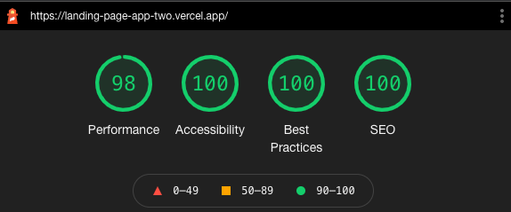

## Engineering Exercise

Thanks for the opportunity and the time you're taking to review this excercise.
## Run this repo in development mode

- Clone this repo
```bash
  git clone https://github.com/josemariogutierrez/landing-page-app.git
```
- Install dependencies
```
  cd landing-page-app && npm i
```
- Start the server
```
npm run dev
```
- Open [http://localhost:3000](http://localhost:3000) with your browser to see the result.
- This website is also being deployed using [Vercel](https://vercel.com/), check the live url [https://landing-page-app-two.vercel.app/](https://landing-page-app-two.vercel.app/)


## About
For this excercise i focused on getting as close as posible to the design in the time frame. Implemented a mobile first approach changing the styles when reaching 600px width.

- This project was bootstrapped with
[`create-next-app`](https://github.com/vercel/next.js/tree/canary/packages/create-next-app).

- The only additional dependency used was [`sass`](https://nextjs.org/docs/basic-features/built-in-css-support#sass-support)

Also I focused on getting good results in Accesibility, Best practices, SEO and performance when runing LightHouse report. Here is the report for the desktop version.



### Design Reference

Here is the [Figma file](https://www.figma.com/file/D4KdNst8Kcxq6WpPqQyqI3/SK-Engineering-Exercise?node-id=0%3A1) for the fictitious company Better Paint.


## Things to Improve

Some things I would've liked to do with more time.

- Separate content from the components.
- Make the form work.
- Add a favicon.
- Improve performance for mobile reported by LightHouse.
- Ask design for Futura font, hover state styles for buttons and form validation design examples.
- Find a better naming for css classes (I Don't have much experience using css modules).
- Add animations to bring more life ❤️
